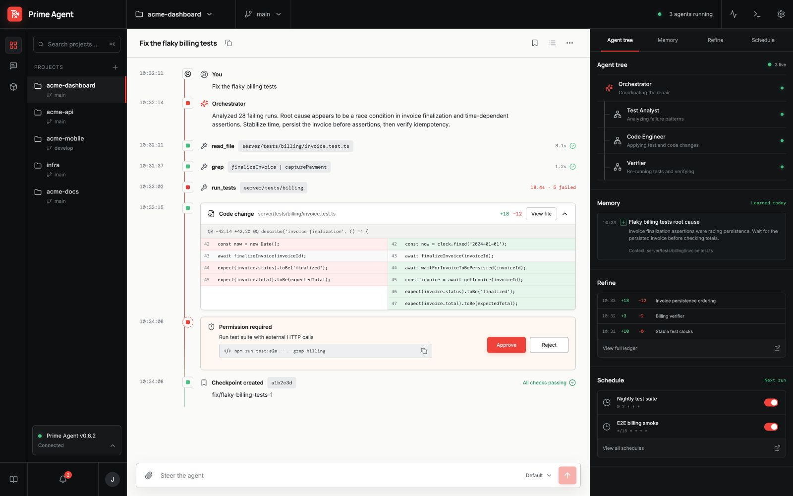

<p align="center">
  
</p>

<h1 align="center">Prime Agent Desktop</h1>

<p align="center">
  <strong>See what your agents do, learn, and change.</strong><br>
  A local-first desktop control center for the open-source Prime Agent harness.
</p>

<p align="center">
  
  
  
  
</p>

<p align="center">
  
</p>

Prime Agent is unusually good at long-running work: persistent sessions, subagents, schedules, memory, and a continual harness that can improve its own playbook. Those capabilities deserve more than a terminal transcript.

Prime Agent Desktop turns them into a visible, reviewable workspace.

## What you can see

- **Execution timeline** — follow reasoning summaries, tool calls, code changes, approvals, and checkpoints without reading raw logs.
- **Agent tree** — see which subagents are live, what each one is doing, and where work is blocked.
- **Memory** — inspect what the agent intends to carry into future sessions.
- **Refine ledger** — review durable changes to memories, prompts, and skills before they become invisible behavior.
- **Schedules** — understand which jobs keep running after the terminal disconnects.
- **Permission gates** — approve or reject consequential commands with the exact command and impact in view.

## Current state

This repository is an interactive product MVP, not yet a production Prime Agent client.

The UI, approval flow, project switching, diff expansion, memory/refine views, schedule toggles, and steering composer are functional. They currently run against `MockAgentAdapter` so the product can be tested independently of an upstream process.

The next milestone is connecting the existing boundary in `src/runtime/PrimeRpcAdapter.ts` to a pinned Prime Agent JSON/RPC release.

## Run it

Requirements: Node.js 20+ and npm.

```bash
git clone https://github.com/zhouzhuozhzh-maker/prime-agent-desktop.git
cd prime-agent-desktop
npm install
npm run dev
```

Open `http://127.0.0.1:5173`.

For the native Tauri shell, install the platform prerequisites and run:

```bash
npm run desktop
```

Production checks:

```bash
npm run check
npm run build
```

## Architecture

```text
React product UI
      │
      ▼
 AgentAdapter
   ├── MockAgentAdapter       interactive preview
   └── PrimeRpcAdapter        upstream integration seam
             │
             ▼
       Prime Agent RPC
```

Runtime-specific protocol code stays behind `AgentAdapter`; React consumes a small event model for timelines, approvals, status, memory, and refinements. That keeps the UI testable and leaves room for future ACP or app-server adapters.

See [docs/architecture.md](docs/architecture.md) for the integration rules.

## Product roadmap

- [x] Complete desktop workspace and interaction model
- [x] Tauri 2 shell configuration
- [x] Mock runtime for visual and workflow testing
- [ ] Prime Agent RPC process supervision and reconnect
- [ ] Real streamed tool-call and subagent events
- [ ] Approval round-trip to the upstream harness
- [ ] Memory/refine diff ingestion and rollback
- [ ] Local encrypted credential storage
- [ ] Signed macOS and Windows preview builds
- [ ] Auto-update channel

## Design

The visual system pairs dark operational chrome with a paper-white execution surface. Coral marks live activity and permission boundaries; mint is reserved for verified success. The center stays deliberately calm while the surrounding rails expose long-running state.

The original design concept is preserved at [`docs/assets/design-concept.png`](docs/assets/design-concept.png). README imagery is captured from the running implementation.

## Safety

Prime Agent can execute model-generated Python and project commands with the current user's permissions. A desktop interface does not turn that process into a sandbox.

Use disposable clones or worktrees, keep approvals enabled, and do not run untrusted repositories or skills without external isolation.

## Contributing

See [CONTRIBUTING.md](CONTRIBUTING.md). The most valuable near-term contribution is a narrowly scoped Prime Agent RPC adapter that preserves explicit approvals and durable-change auditing.

## Project status and attribution

Prime Agent Desktop is an unofficial community project. It is not affiliated with or endorsed by Prime Intellect. Prime Agent and associated names belong to their respective owners.

Released under the [MIT License](LICENSE).
