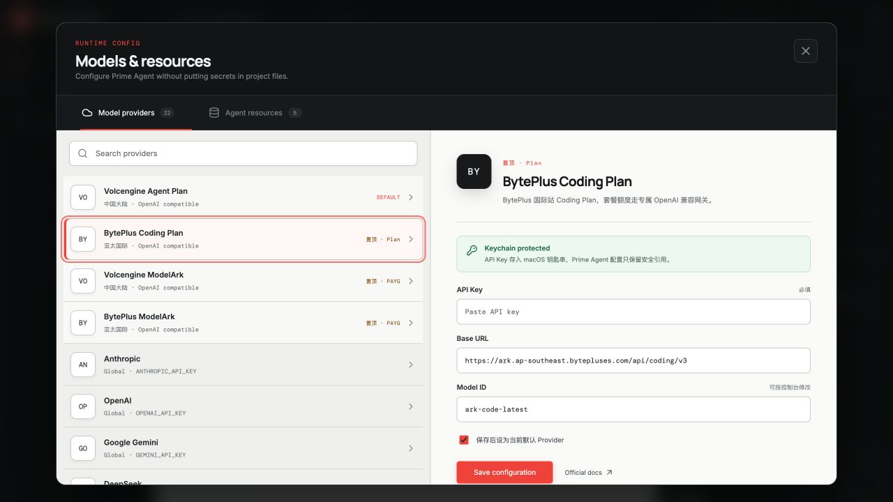
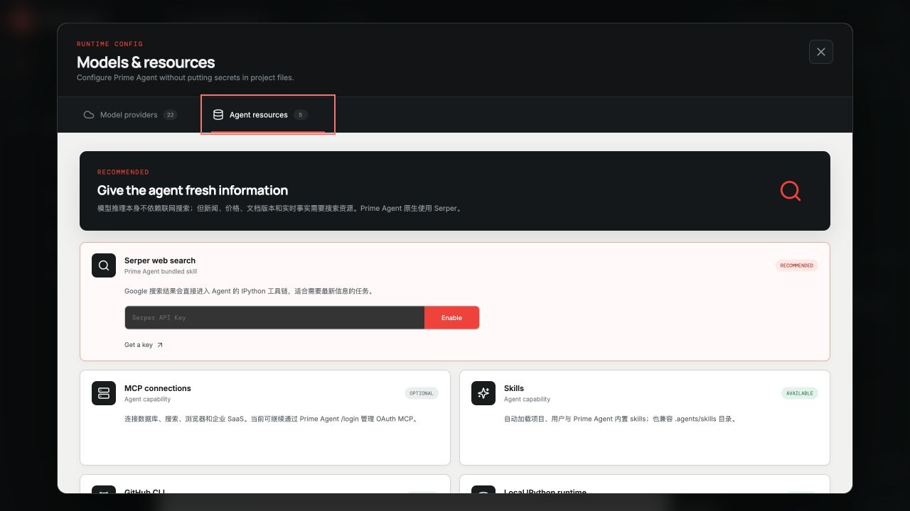

<p align="center">
  
</p>

<h1 align="center">Prime Agent Desktop</h1>

<p align="center">
  <strong>See what your agents do, learn, and change.</strong><br>
  A local-first desktop control center for the open-source Prime Agent harness.
</p>

<p align="center">
  
  
  
  
</p>

<p align="center">
  
</p>

Prime Agent is unusually good at long-running work: persistent sessions, subagents, schedules, memory, and a continual harness that can improve its own playbook. Those capabilities deserve more than a terminal transcript.

Prime Agent Desktop turns them into a visible, reviewable workspace.

## What you can see

- **Execution timeline** — follow reasoning summaries, tool calls, code changes, approvals, and checkpoints without reading raw logs.
- **Agent tree** — see which subagents are live, what each one is doing, and where work is blocked.
- **Memory** — inspect what the agent intends to carry into future sessions.
- **Refine ledger** — review durable changes to memories, prompts, and skills before they become invisible behavior.
- **Schedules** — understand which jobs keep running after the terminal disconnects.
- **Permission gates** — approve or reject consequential commands with the exact command and impact in view.
- **Review loop** — collect file changes in one place, jump back to the full diff, and copy commands without leaving the task.
- **Fast task control** — start clean sessions, reconnect interrupted runtimes, and steer agents with a keyboard-friendly multiline composer.

## Current state

The native app now connects to Prime Agent's documented RPC mode. It launches `prime-agent --mode rpc` inside the folder you choose, supervises the process, correlates command responses, and renders streaming messages and tool execution events. Extension confirmations, selections, inputs, and editor requests make a round trip through the desktop UI.

The browser build still uses `MockAgentAdapter`, so the product can be reviewed without granting an agent access to a local project. The live integration is tested against Prime Agent `0.7.3`.

The desktop workflow is designed around a complete agent loop: start a task, supervise progress, intervene when needed, review changes, and recover from an interrupted runtime. Visible controls are functional; new sessions open with useful starter prompts, settings remember focus, and saved provider state is explicit.

## Models & resources

The desktop settings center now configures Prime Agent directly. Volcengine Agent Plan, BytePlus Coding Plan, and both ModelArk pay-as-you-go endpoints are pinned first, followed by the API-key providers in Prime Agent's current built-in catalog: Anthropic, OpenAI, Gemini, DeepSeek, OpenRouter, xAI, Groq, Mistral, Cerebras, Z.AI, Fireworks, Kimi, MiniMax, Hugging Face, Vercel AI Gateway, Prime Inference, and Xiaomi MiMo.

<p align="center">
  
</p>

On macOS, API keys are saved in Keychain. Prime Agent's `auth.json` and `models.json` contain only a shell reference that retrieves the secret at runtime; project files never receive the key. Saving a new default provider restarts the local RPC session so it takes effect immediately.

Live web information is optional. For news, prices, current documentation, and other time-sensitive work, the Resources tab can enable Prime Agent's bundled Serper web-search skill. It also reports MCP, Skills, GitHub CLI, and local IPython readiness.

<p align="center">
  
</p>

## Run it

Requirements: Node.js 22.8+, npm, Rust/Tauri platform prerequisites, and the Prime Agent CLI.

Install Prime Agent from its official release channel:

```bash
curl -fsSL https://app.primeintellect.ai/prime-agent/install.sh | sh
```

```bash
git clone https://github.com/zhouzhuozhzh-maker/prime-agent-desktop.git
cd prime-agent-desktop
npm install
npm run dev
```

Open `http://127.0.0.1:5173` for the interactive demo.

For the native Tauri shell, install the platform prerequisites and run:

```bash
npm run desktop
```

The native app asks for a project folder on first launch and starts the local RPC process there. If `prime-agent` is not on the macOS app PATH, set `PRIME_AGENT_BIN` to its absolute path before launching; common nvm, Volta, and local-bin locations are detected automatically.

If the runtime card says **model setup required**, run `prime-agent` once in a terminal and use `/login` (or configure a supported provider API key). The desktop RPC process reuses Prime Agent's local authentication store.

Production checks:

```bash
npm run check
npm run build
```

## Architecture

```text
React product UI
      │
      ▼
 AgentAdapter
   ├── MockAgentAdapter       interactive preview
   └── PrimeRpcAdapter        JSONL command/event mapping
             │
             ▼
       Tauri process bridge
             │
             ▼
  prime-agent --mode rpc
```

Runtime-specific protocol code stays behind `AgentAdapter`; React consumes a small event model for timelines, approvals, status, memory, and refinements. That keeps the UI testable and leaves room for future ACP or app-server adapters.

See [docs/architecture.md](docs/architecture.md) for the integration rules.

## Product roadmap

- [x] Complete desktop workspace and interaction model
- [x] Tauri 2 shell configuration
- [x] Mock runtime for visual and workflow testing
- [x] Prime Agent RPC process supervision
- [x] Real streamed message and tool-call events
- [x] Extension UI request/response round-trip
- [x] Provider catalog and default-model configuration
- [x] macOS Keychain credential storage
- [x] Serper web-search resource configuration
- [x] Manual session reconnect and focused change review
- [ ] Live subagent observation from upstream RPC events
- [ ] Memory/refine diff ingestion and rollback
- [ ] Windows Credential Manager and Linux Secret Service backends
- [ ] Signed macOS and Windows preview builds
- [ ] Auto-update channel

## Design

The visual system pairs dark operational chrome with a paper-white execution surface. Coral marks live activity and permission boundaries; mint is reserved for verified success. The center stays deliberately calm while the surrounding rails expose long-running state.

The original design concept is preserved at [`docs/assets/design-concept.png`](docs/assets/design-concept.png). README imagery is captured from the running implementation.

## Safety

Prime Agent can execute model-generated Python and project commands with the current user's permissions. A desktop interface does not turn that process into a sandbox.

Use disposable clones or worktrees, keep approvals enabled, and do not run untrusted repositories or skills without external isolation.

## Contributing

See [CONTRIBUTING.md](CONTRIBUTING.md). The most valuable near-term work is session reconnect, subagent observation, and ingestion of durable memory/refinement changes.

## Project status and attribution

Prime Agent Desktop is an unofficial community project. It is not affiliated with or endorsed by Prime Intellect. Prime Agent and associated names belong to their respective owners.

Released under the [MIT License](LICENSE).
